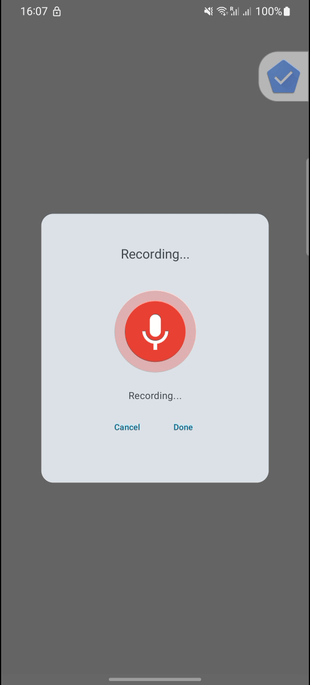

# VeView SDK for Android

[](https://opensource.org/licenses/Apache-2.0)
[](https://jitpack.io/#SunnyBe/VeView/Tag)

The VeView SDK for Android provides a simple and powerful way to integrate voice feedback and review capabilities into your Android application. It handles audio recording, processing, and AI-powered transcription, allowing you to focus on building your app's core features.

## ✨ Features

*   **Effortless Integration**: Add voice review functionality to your app in minutes.
*   **AI-Powered Transcription**: Converts spoken reviews into text using state-of-the-art AI.
*   **Customizable Analysis**: Define your own data structure for the analysis response, giving you full control over the data you receive.
*   **Modern Architecture**: Built with Kotlin, Coroutines, and Flow for a reactive, non-blocking, and thread-safe solution.
*   **Robust State Management**: Observe the entire voice review lifecycle through a `StateFlow`, making UI updates a breeze.
*   **Lifecycle Aware**: Seamlessly integrates with Android's lifecycle components (`ViewModel`, `Activity`, `Fragment`) to handle configuration changes gracefully.
*   **Highly Configurable**: Customize recording duration, storage options, and more.
*   **Dynamic Configuration**: Alter SDK behavior on the fly using local or remote configuration providers.
*   **Testable**: Designed for testability, with decoupled business logic and hardware interactions.

## 📸 Demo

The following GIF demonstrates the ideal user flow, from initiating a voice review to successfully receiving the transcribed and analyzed feedback.

<p align="center">
  
</p>

For more detailed examples, including error handling and the full end-to-end flow, please see our collection of demo videos and GIFs:

*   [Full Happy Path (MP4)](demo/demo_happy_path.mp4)
*   [Non-Happy Path: String Parsing Error (GIF)](demo/demo_non_happy_string_parsing.gif)
*   [Non-Happy Path: Socket Closed (GIF)](demo/demo_unhappy_socket_close.gif)

## 🚀 Getting Started

Here's a quick guide to get you up and running. For more detailed instructions, see our [SDK Usage Guide](SDK_USAGE.md).

### 1. Add the Dependency

Add the JitPack repository to your `settings.gradle.kts`:
```kotlin
// settings.gradle.kts
dependencyResolutionManagement {
    repositories {
        mavenCentral()
        maven { url = uri("https://jitpack.io") }
    }
}
```

Then, add the SDK dependency to your module's `build.gradle.kts`:
```kotlin
// build.gradle.kts
dependencies {
    implementation("com.github.SunnyBe:VeView:1.0.0")
}
```

### 2. Initialize the SDK

Here is a basic setup using default configurations.

> **Note:** For now, the VeView SDK uses the OpenAI API for its analysis features. You will need to provide an API key from the [OpenAI Platform](https://platform.openai.com/) to initialize the SDK.

```kotlin
val veViewSDK = VeViewSDK.Builder(
    apiKey = "YOUR_OPENAI_API_KEY_HERE",
).build()

// Get a VoiceReviewer instance with default configurations
val voiceReviewer = veViewSDK.newAudioReviewer(
    context = applicationContext
)
```

### 3. Basic Usage

To start a voice review, create a `ReviewContext` and call the `start` method.

```kotlin
// Create a context for the review
val reviewContext = ReviewContext(reviewId = "unique-review-id-123")

// Start the voice review process
voiceReviewer.start(reviewContext)
```

You can observe the `voiceReviewer.state` to get updates on the review process (recording, processing, success, or error).

If you need to cancel the review at any point, simply call the `cancel` method.

```kotlin
voiceReviewer.cancel()
```

This will stop the recording and any ongoing processing.

For more advanced usage and configuration options, including how to use a custom data model for the analysis response, please refer to the [SDK Usage Guide](SDK_USAGE.md).

## 🗺️ Roadmap

We are continuously working to improve the VeView SDK. Here are some of the features and enhancements you can expect in future releases:

*   **Granular Error Handling**: We plan to replace the current generalized error reporting with a more granular system. This will provide specific error types for different failure scenarios, such as `AudioRecordPermission`, `InternetConnection`, and more, allowing for better error handling on the client-side.
*   **Video Reviews**: We are working on incorporating video reviews into the SDK, allowing users to provide even richer feedback.
*   **Retry analysis**: A failed analysis currently requires starting over. We will allow only analysis for the last recorded audio.
*   **Multi-Language Reviews**: We are planning to add support for multiple languages, allowing users to provide feedback in their preferred language.
*   **Custom Prompts and Configuration**: Future versions will allow clients to provide their own custom prompts and other business configurations through a JSON file in their `res/raw` directory, offering greater flexibility.

## 💬 Feedback and Support

If you encounter any issues, have questions, or would like to suggest a new feature, please [open an issue](https://github.com/SunnyBe/VeView/issues) on our GitHub repository. We appreciate your feedback and will do our best to address it as quickly as possible.

## 🤝 Contributor Setup

To ensure a consistent development environment, we use Gradle's dependency locking. After cloning the repository, run the following script to generate the dependency lock files:

```bash
./generate_dependency_locks.sh generate
```

This will create a `gradle.lockfile` in each module's directory. These files should be committed to version control.

## 📦 Third-Party Dependencies

For a full list of third-party libraries used in this SDK, please see the [DEPENDENCIES.md](veview-sdk/DEPENDENCIES.md) file.

## 📄 License

This project is licensed under the Apache 2.0 License - see the [LICENSE](LICENSE) file for details.
